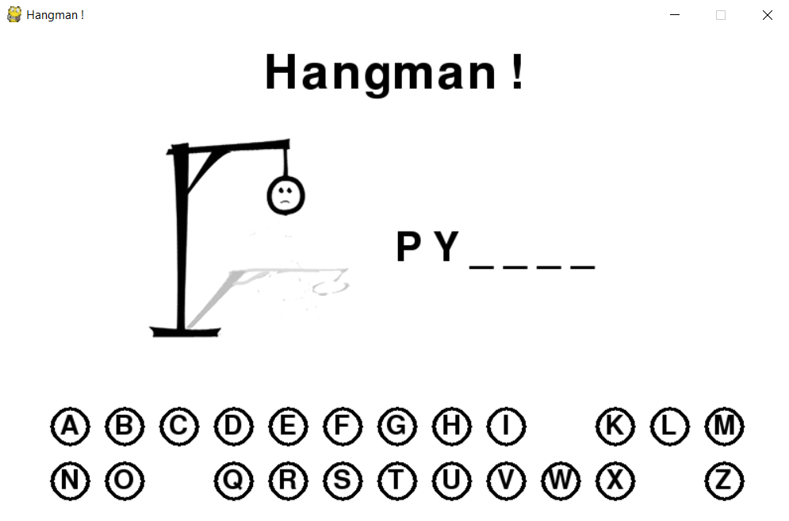
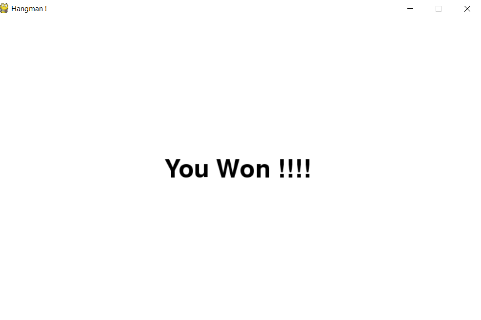
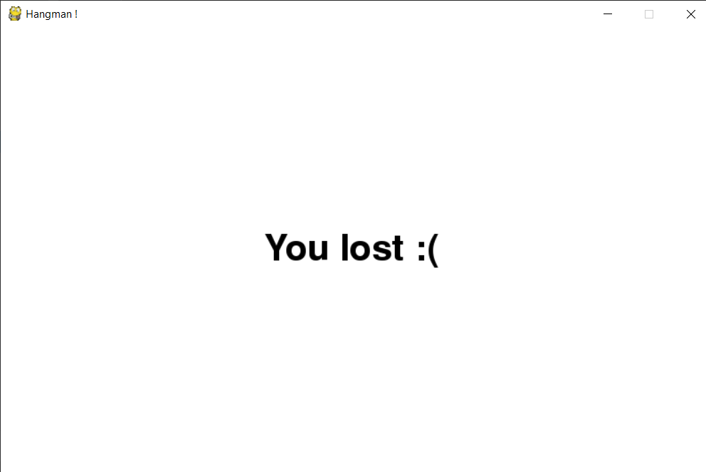
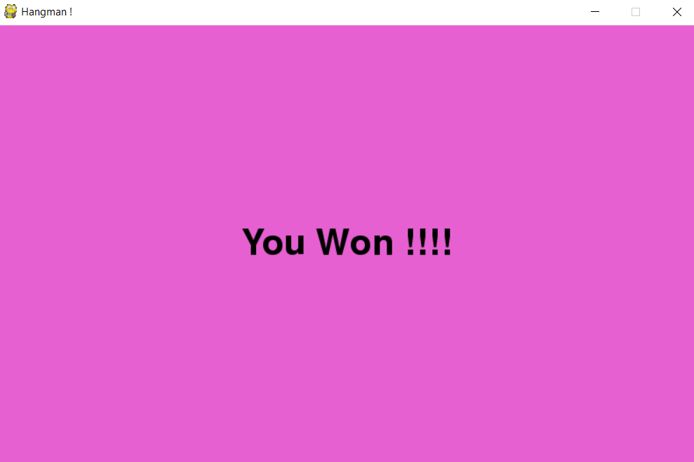

# Hangman_Python
A simple Hangman game created using Python!

## Overview
This repository contains the code to a small project of mine. A simple game of hangman was developed utilizing the PyGame module.
You do have to store a set of words in the code from which one is chosen at random and is given to the user to crack.

## Sample Gameplay

   

    

 
